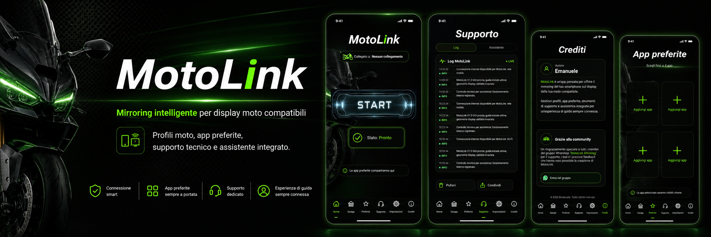
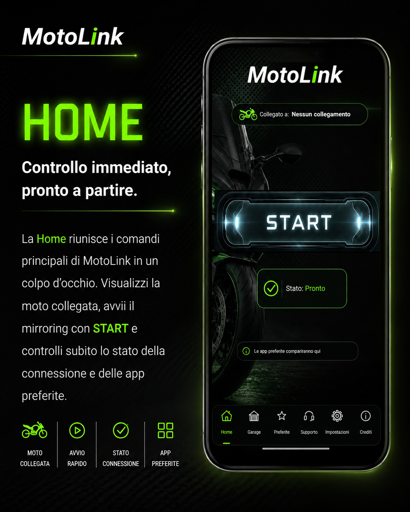
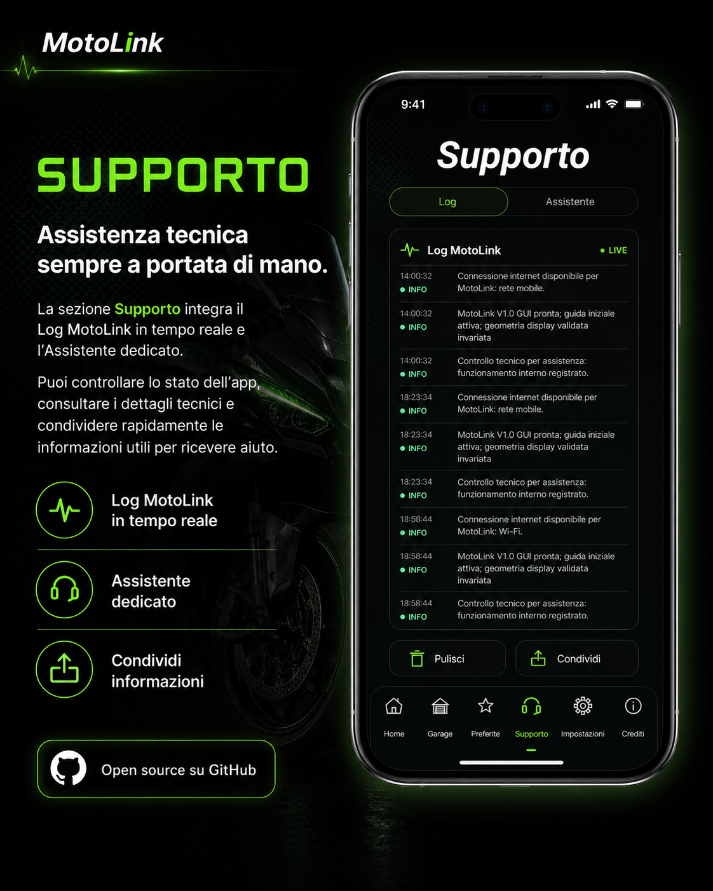
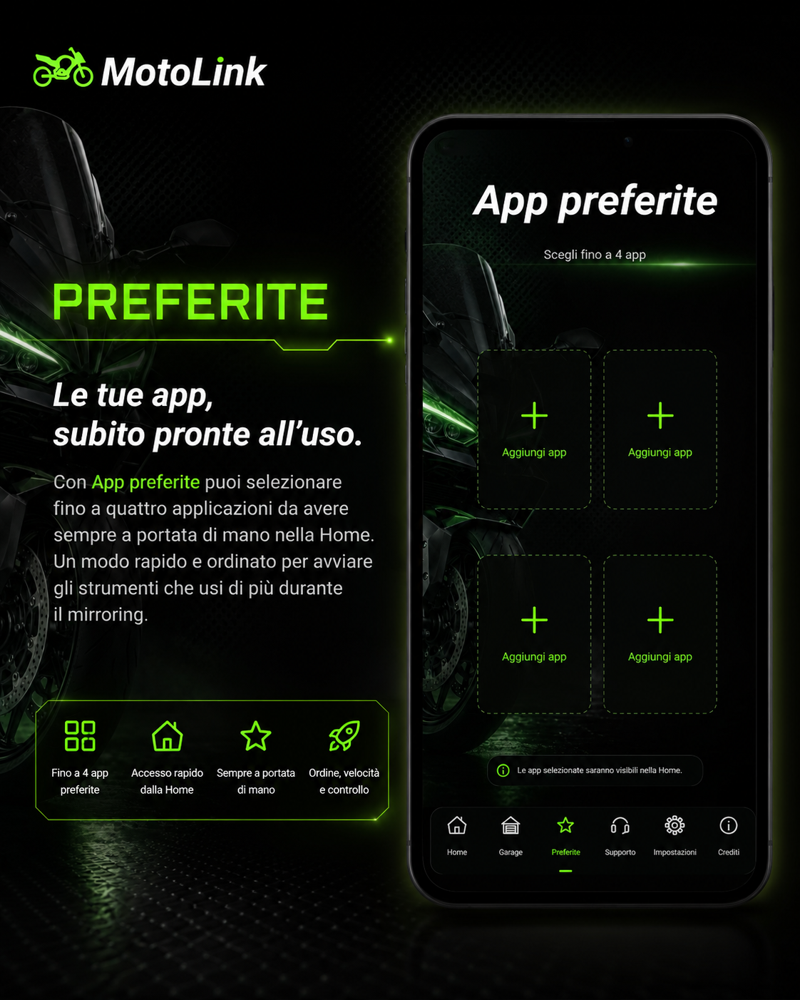
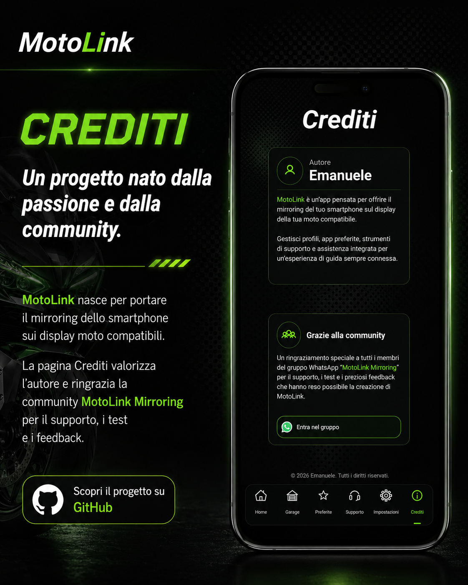

<p align="center">
  
</p>

<p align="center">
  <a href="https://github.com/Mysterx1992/MotoLink/releases/latest/download/MotoLink_V1.0.apk">
    
  </a>
  &nbsp;
  <a href="https://github.com/Mysterx1992/MotoLink/releases/latest">
    
  </a>
  &nbsp;
  <a href="https://chat.whatsapp.com/BNTmFxXQuOkGdYWHrX2rV0?s=cl&p=a&mlu=4">
    
  </a>
</p>

# MotoLink

**Porta il mirroring del tuo smartphone sul display della moto compatibile, con profili dedicati, app preferite, adattamento del display e strumenti di supporto integrati.**

MotoLink è un'app Android progettata per gestire in un unico ambiente il collegamento con il display della moto, il mirroring dello smartphone e le principali funzioni di configurazione e assistenza.

L'interfaccia è pensata per essere semplice e immediata: prepari la sessione a veicolo fermo, selezioni la moto e le app che utilizzi più spesso, quindi avvii il mirroring dalla Home.

> [!IMPORTANT]
> Configura MotoLink, i profili, le applicazioni e le regolazioni **a veicolo fermo**.  
> Non utilizzare lo smartphone o MotoLink in modo da compromettere l'attenzione durante la guida.

---

## Download MotoLink

### APK ufficiale

<a href="https://github.com/Mysterx1992/MotoLink/releases/latest/download/MotoLink_V1.0.apk">
  
</a>

**Pagina dell'ultima release:**  
https://github.com/Mysterx1992/MotoLink/releases/latest

> [!NOTE]
> Nella pagina della Release scarica il file che termina in `.apk`.  
> I file **Source code (zip)** e **Source code (tar.gz)** generati automaticamente da GitHub contengono il codice sorgente e **non sono applicazioni installabili**.

Android può richiedere l'autorizzazione per installare app provenienti da questa fonte. È il normale controllo di sicurezza previsto per APK installati al di fuori di Google Play.

---

## MotoLink in azione

<table>
<tr>
<td width="50%" align="center"></td>
<td width="50%" align="center"></td>
</tr>
<tr>
<td width="50%" align="center"></td>
<td width="50%" align="center"></td>
</tr>
</table>

Gli screenshot originali dell'app sono disponibili in [`docs/screenshots`](docs/screenshots).

---

## Compatibilità moto

MotoLink è progettata per lavorare con display moto compatibili con il flusso di mirroring supportato dall'app.

La compatibilità reale può dipendere da:

- modello della moto;
- display / T-Box installato;
- versione firmware;
- versione Android dello smartphone;
- implementazione EasyConn / Carbit presente sul display.

Moto sul quale l'app è stata testata.

| Marca | Modello | Anno / versione | Display / sistema | Stato | Note |
|---|---|---|---|---|---|
| _Voge_ | _Trofeo_ | _2023_ | _TFT / EasyConn_ | ✅ Testata | _App implementata per questo specifico modello_ |
| _Voge_ | _Valico 900_ | _2026_ | _TFT / EasyConn_ | ✅ Testata | _App testata e funzionante con collegamento qrCode_ |
| _CfMoto_ | _None_ | _None_ | _None_ | No Testata | _App ancora da testare su CfMoto_ |

<!--
ESEMPIO DI RIGA DA COPIARE:
| Voge | MODELLO | 2026 | TFT / EasyConn | ✅ Testata | Mirroring verificato |

Aggiungi solo moto realmente testate.
-->

### Legenda

| Stato | Significato |
|---|---|
| ✅ **Testata** | Collegamento e mirroring verificati direttamente |
| 🧪 **In test** | Compatibilità in fase di verifica |
| ⚠️ **Parziale** | Collegamento presente ma una o più funzioni richiedono ancora verifica |

> [!WARNING]
> Un display simile o appartenente allo stesso marchio **non garantisce automaticamente la compatibilità**. Modello e firmware devono essere verificati separatamente.

---

## Cosa fa MotoLink

### 🏍️ Connessione e mirroring

MotoLink gestisce il collegamento con il display moto compatibile e permette di avviare il mirroring direttamente dalla Home.

Lo stato della sessione rimane visibile nell'interfaccia e le funzioni di connessione restano separate dagli strumenti online di supporto.

### 🏠 Garage e profili moto

Il Garage permette di salvare e gestire i profili delle moto.

Ogni profilo può mantenere le proprie impostazioni e regolazioni, così da non dover riconfigurare l'app ogni volta che si passa da una moto a un'altra.

Quando previsto dal display, MotoLink può utilizzare il QR per la configurazione; in alternativa è disponibile il profilo locale secondo le funzioni presenti nell'app.

### ⭐ App preferite

Puoi selezionare fino a **quattro applicazioni preferite**.

Le app selezionate diventano rapidamente disponibili dalla Home, rendendo più semplice avviare gli strumenti utilizzati più spesso durante il mirroring.

### 📐 Adattamento display

MotoLink include strumenti per adattare manualmente l'immagine alle dimensioni e alla geometria del display della moto.

Le regolazioni vengono mantenute per il relativo profilo moto.

### 📱 Modalità tasca

Durante il mirroring, MotoLink mette a disposizione due sistemi per gestire lo schermo dello smartphone senza interrompere la sessione.

- **Doppio tocco su Volume Giù**: spegne lo schermo tramite la funzione MotoLink e blocca i tocchi accidentali. (controllare sempre di avere il volume, senza volume non funziona)
- **Nuovo doppio tocco su Volume Giù**: riattiva lo schermo e ripristina l'utilizzo normale del telefono.
- **Sensore di prossimità**: quando lo smartphone viene coperto o riposto in tasca, il display può spegnersi automaticamente; quando il sensore torna libero, lo schermo si riattiva.

In questo modo il telefono può rimanere in tasca o al riparo durante il mirroring, riducendo illuminazione e tocchi indesiderati senza interrompere la connessione con il display della moto.

### 🧰 Log MotoLink

La sezione **Supporto → Log** mostra le informazioni tecniche utili alla diagnosi.

Il Log:

- resta locale sul dispositivo;
- non viene cancellato automaticamente;
- rimane disponibile fino al comando esplicito **Pulisci**;
- può essere condiviso dall'utente quando serve assistenza.

### 🤖 Assistente MotoLink

L'Assistente è dedicato esclusivamente al supporto tecnico MotoLink.

Può aiutare a:

- comprendere le funzioni dell'app;
- individuare possibili problemi di connessione;
- interpretare comportamenti anomali;
- analizzare volontariamente un estratto del Log;
- suggerire controlli da effettuare.

Una normale conversazione **non legge automaticamente il Log**.

Per allegare volontariamente la diagnostica:

**Supporto → Log → Condividi → Assistente**

MotoLink applica un filtro alle informazioni tecniche prima dell'elaborazione.

Se l'Assistente non dispone di informazioni sufficienti, l'utente può continuare il supporto con la community **MotoLink Mirroring**.

---

### 🔋 Consiglio per il risparmio energetico

Per evitare che Android limiti MotoLink durante il mirroring, è consigliato impostare il risparmio energetico dell'app su **Nessuna restrizione**.

Il percorso può cambiare in base al produttore dello smartphone, ma in genere si trova in:

**Impostazioni → App → MotoLink → Batteria / Risparmio energetico → Nessuna restrizione**

Questa impostazione aiuta MotoLink a rimanere attiva correttamente durante le sessioni di mirroring e può ridurre interruzioni dovute alla gestione aggressiva della batteria.

---

## Permessi e privacy

MotoLink richiede soltanto gli accessi necessari alle funzioni utilizzate dall'utente.

| Accesso / conferma | Quando viene usato | Perché serve |
|---|---|---|
| **Rete / Wi-Fi** | Durante il collegamento alla moto | Individuare e utilizzare la connessione richiesta dal display |
| **MediaProjection / condivisione schermo** | All'avvio del mirroring | Android richiede la conferma dell'utente prima di catturare lo schermo o una singola app |
| **Mostra sopra altre app** | Solo per le funzioni che lo richiedono | Gestire la Modalità tasca / schermo nero secondo la configurazione dell'app |

> [!NOTE]
> Android mantiene sotto il controllo dell'utente le conferme di condivisione dello schermo. MotoLink non può approvare silenziosamente la cattura di un'app o dell'intero display.

### Dati e Assistente

- Profili e preferenze vengono gestiti localmente dall'app.
- Il Log tecnico rimane locale finché l'utente non sceglie di condividerlo.
- Durante una chat normale il Log non viene inviato automaticamente.
- L'invio della diagnostica richiede un'azione esplicita.
- Le informazioni tecniche vengono filtrate prima dell'elaborazione.
- Il database dell'Assistente non viene utilizzato come archivio permanente delle conversazioni o dei Log inviati.

Per maggiori informazioni consulta [`PRIVACY.md`](PRIVACY.md).

---

## Supporto e community

### Assistente integrato

Apri:

**Supporto → Assistente**

### Log tecnico

Apri:

**Supporto → Log**

### MotoLink Mirroring su WhatsApp

<a href="https://chat.whatsapp.com/BNTmFxXQuOkGdYWHrX2rV0?s=cl&p=a&mlu=4">
  
</a>

La community contribuisce con test su moto e display differenti, feedback e supporto agli utenti.

---

## Stato del progetto

| Voce | Stato |
|---|---|
| Applicazione Android | ✅ Disponibile |
| Release pubblica | ✅ `v1.0` |
| Mirroring | ✅ Implementato |
| Garage / profili moto | ✅ Implementato |
| App preferite | ✅ Implementato |
| Adattamento display | ✅ Implementato |
| Modalità tasca | ✅ Implementata |
| Log tecnico | ✅ Implementato |
| Assistente MotoLink | ✅ Implementato |
| Compatibilità moto | 🔄 In aggiornamento con i test reali |

MotoLink continua a essere verificata su combinazioni differenti di smartphone, display e firmware.

---

## Codice sorgente

Il codice sorgente di MotoLink è pubblico in questa repository.

```text
MotoLink/
├── app/                 # Applicazione Android
├── gradle/              # Gradle Wrapper
├── supabase/            # Componenti backend pubblicabili / configurazione di riferimento
├── docs/                # Immagini, screenshot e documentazione
├── build.gradle.kts
├── settings.gradle.kts
└── README.md
```


---

## Avvertenza durante la guida

MotoLink è uno strumento di mirroring e supporto.

**Non deve essere utilizzata come unica fonte di informazioni critiche durante la guida.**

Configura destinazioni, applicazioni, profili e regolazioni prima di partire e utilizza sempre i sistemi della moto nel rispetto delle norme di sicurezza e del Codice della Strada applicabile.

---

## Progetto e marchi

MotoLink è un progetto indipendente.

I nomi, i marchi, i loghi, i sistemi operativi e i servizi di terze parti eventualmente citati appartengono ai rispettivi proprietari.

MotoLink non implica affiliazione o approvazione da parte dei produttori di moto, display o servizi citati.

---

## Licenza e copyright

**Copyright © 2026 Emanuele. Tutti i diritti riservati.**

Il codice sorgente di MotoLink è pubblicamente consultabile per finalità di studio, trasparenza e verifica.

Non è concessa alcuna autorizzazione a copiare, modificare, distribuire, sublicenziare, vendere, ripubblicare o creare opere derivate dal software, in tutto o in parte, senza previa autorizzazione scritta del titolare del copyright.

Il nome **MotoLink**, il branding, la grafica, la documentazione e gli asset associati sono anch'essi protetti.

Per i termini completi consulta il file [`LICENSE`](LICENSE).

---

<p align="center">
  <strong>MotoLink</strong><br>
  Mirroring • Connessione • Supporto
</p>
