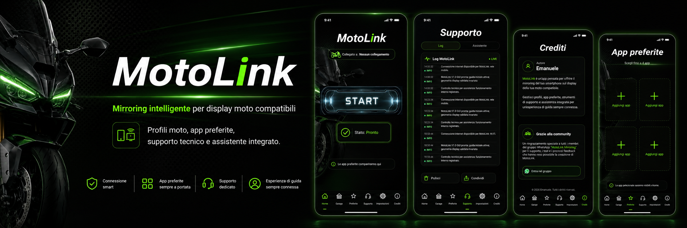
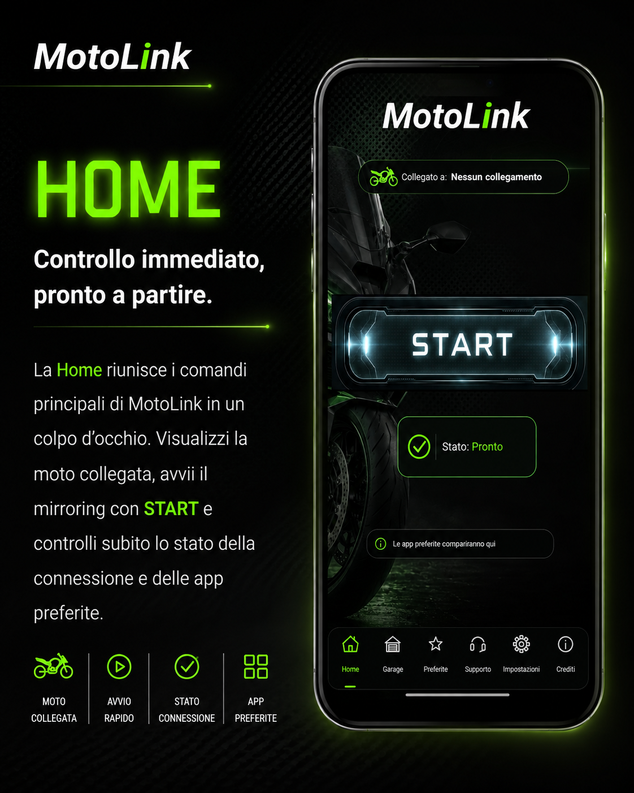
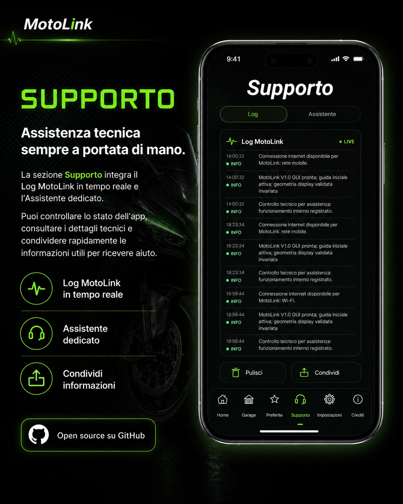
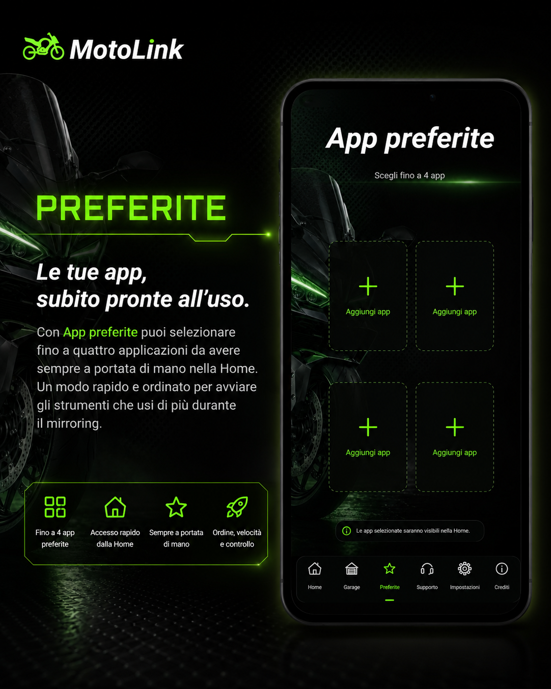
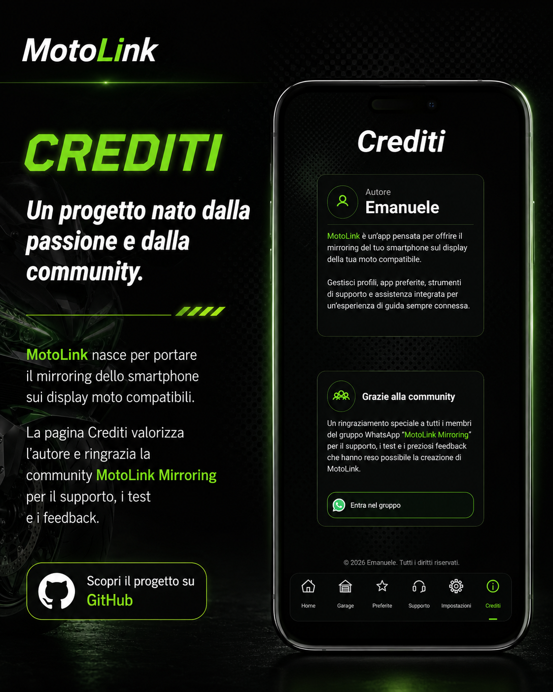

  

  
  &nbsp;
  

# MotoLink

**Porta il mirroring del tuo smartphone sul display della moto compatibile, con profili dedicati, app preferite, adattamento del display e strumenti di supporto integrati.**

MotoLink è un'app Android progettata per gestire in un unico ambiente il collegamento con il display della moto, il mirroring dello smartphone e le principali funzioni di configurazione e assistenza.

> [!IMPORTANT]
> Configura MotoLink, i profili, le applicazioni e le regolazioni **a veicolo fermo**. Non utilizzare lo smartphone o MotoLink in modo da compromettere l'attenzione durante la guida.

---

## 🆕 MotoLink V1.7

MotoLink **V1.7** aggiunge l'interfaccia multilingua automatica e migliora la navigazione Google Maps sui telefoni impostati in russo, mantenendo il recovery TFT/EasyConn e la Modalità tasca già consolidati.

### Novità V1.7

- Lingua dell'interfaccia automatica in base alla lingua del telefono.
- Traduzioni complete in Italiano, English, Русский e 中文; fallback inglese per le altre lingue.
- Guida iniziale e avviso di sicurezza tradotti.
- Google Maps: supporto alle notifiche russe, comprese unità cirilliche м/км, spazi Unicode, tempi e principali manovre testuali.
- Navigazione BLE turn-by-turn migliorata sui telefoni in russo, inclusa VOGE Valico 625 DSX.
- Reader Google Maps esteso a `EXTRA_TEXT_LINES`, viste compatte/estese/heads-up e accessibility text.
- Rotonde migliorate su tutte le lingue con riconoscimento visivo language-agnostic e codifica VOGE di settore/direzione d'uscita.
- Diagnostica Maps privacy-safe per identificare i campi realmente esposti senza salvare strade o destinazioni.
- Il tasto Versione App mostra soltanto gli aggiornamenti della V1.7.
- Recovery vc28, MediaProjection, H264 e Modalità tasca preservati.

---

## Scarica MotoLink

**[⬇️ Scarica direttamente MotoLink V1.7 APK](https://github.com/Mysterx1992/MotoLink/releases/download/v1.7/MotoLink_V1.7.apk)**

Versione corrente: **MotoLink V1.7** · `versionCode 31`  
Package: `it.motolink.app`

Release: https://github.com/Mysterx1992/MotoLink/releases/tag/v1.7

---

## MotoLink in azione

<table>
<tr>
<td width="50%" align="center"></td>
<td width="50%" align="center"></td>
</tr>
<tr>
<td width="50%" align="center"></td>
<td width="50%" align="center"></td>
</tr>
</table>

Gli screenshot originali dell'app sono disponibili in [`docs/screenshots`](docs/screenshots).

---

## Compatibilità moto

MotoLink è progettata per lavorare con display moto compatibili con i flussi supportati dall'app: mirroring EasyConn/Hotspot/QR e, sui modelli compatibili, navigazione BLE turn-by-turn.

La compatibilità reale può dipendere da modello della moto, display/T-Box, firmware, versione Android e implementazione EasyConn/Carbit/BLE presente sul display.

Moto sulle quali l'app è stata testata:

| Marca | Modello | Anno / versione | Display / sistema | Stato | Note |
|---|---|---|---|---|---|
| _Voge_ | _Trofeo_ | _2023_ | _TFT / EasyConn_ | ✅ Testata | _App implementata per questo specifico modello_ |
| _Voge_ | _Valico 900_ | _2026_ | _TFT / BLE / EasyConn dove disponibile_ | ✅ Testata | _Navigazione BLE fisicamente verificata; QR/EasyConn disponibile sulle configurazioni compatibili_ |
| _Voge_ | _Valico 625 DSX_ | _2025_ | _TFT / BLE_ | ✅ Testata | _Navigazione turn-by-turn BLE fisicamente verificata_ |
| _CFMOTO_ | _700 MT Stradale_ | _2024_ | _TFT / EasyConn_ | ✅ Testata | _Connessione P2P/EasyConn e avvio video verificati fisicamente nella lineage V1.5/V1.5.1_ |

> [!WARNING]
> Un display simile o appartenente allo stesso marchio **non garantisce automaticamente la compatibilità**. Modello e firmware devono essere verificati separatamente.

---

## Cosa fa MotoLink

### 🏍️ Connessione, mirroring e BLE

MotoLink gestisce il collegamento con il display moto compatibile. I profili Hotspot/QR vengono utilizzati per il mirroring EasyConn; il profilo BLE è dedicato alla navigazione turn-by-turn sui TFT VOGE compatibili.

### 🏠 Garage e profili moto

Il Garage permette di salvare e gestire fino a tre profili moto. Ogni profilo può mantenere le proprie impostazioni e regolazioni di Adattamento.

Al primo START, se non esiste ancora un profilo, MotoLink permette di scegliere **Hotspot, QR Code oppure BLE** e guida l'utente nella creazione del profilo prima di continuare la connessione.

### 🧭 Navigazione BLE

Con un profilo BLE compatibile MotoLink legge le indicazioni di navigazione esposte da Google Maps tramite il Notification Listener autorizzato dall'utente e le converte nel protocollo turn-by-turn del TFT. La modalità BLE non effettua mirroring video.

### ⭐ App preferite

Puoi selezionare fino a **quattro applicazioni preferite** e richiamarle rapidamente dalla Home.

### 📐 Adattamento display

MotoLink include strumenti per adattare manualmente l'immagine alla geometria del display della moto. Le regolazioni vengono mantenute per il relativo profilo moto e per orientamento.

### 📱 Modalità tasca

Durante il mirroring, se **Modalità tasca è attiva**, MotoLink può utilizzare il sensore di prossimità per oscurare lo schermo. Con **Modalità tasca disattivata**, resta preservata la protezione vc22. Con Modalità tasca attiva, resta congelato il fix vc27: il gate V1.5.1 arma la prossimità solo quando MediaProjection/video sono realmente pronti. Il comando con **doppio Volume Giù** resta disponibile separatamente per oscurare/riattivare lo schermo con blocco dei tocchi senza interrompere la sessione.

### 🧰 Log MotoLink

La sezione **Supporto → Log** mostra al massimo le ultime **50 righe** per mantenere l'interfaccia leggera.

Il Log tecnico completo:

- resta locale sul dispositivo;
- non viene cancellato automaticamente;
- rimane disponibile fino al comando esplicito **Pulisci**;
- può essere condiviso dall'utente quando serve assistenza;
- viene conservato integralmente nel file `.txt`, anche quando la schermata mostra soltanto le righe più recenti.

### 🤖 Assistente MotoLink

L'Assistente è dedicato esclusivamente al supporto tecnico MotoLink. Una normale conversazione **non legge automaticamente il Log**.

Per allegare volontariamente la diagnostica:

**Supporto → Log → Condividi → Assistente**

MotoLink applica un filtro alle informazioni tecniche prima dell'elaborazione.

---

## Permessi e privacy

MotoLink è stata progettata per ridurre al minimo le autorizzazioni richieste e **non utilizza servizi di Accessibilità**.

La scansione QR può utilizzare Google Code Scanner oppure il fallback interno quando necessario.

Le funzioni tecniche possono richiedere:

| Accesso / conferma | Quando viene usato | Perché serve |
|---|---|---|
| **Connessione moto / Wi-Fi** | Collegamento Hotspot/QR | Comunicazione con il TFT tramite Wi-Fi / Wi-Fi Direct. |
| **Dispositivi Bluetooth vicini** | Profilo BLE | Scansione, connessione e comunicazione turn-by-turn con TFT BLE compatibili. |
| **Accesso alle notifiche** | Navigazione BLE con Google Maps | Lettura delle indicazioni di navigazione esposte dalla notifica di Google Maps. |
| **Fotocamera** | Solo quando serve il fallback scanner QR interno | Lettura del QR della moto. |
| **MediaProjection / condivisione schermo** | Avvio mirroring | Autorizzazione Android alla cattura dello schermo o di una singola app. |
| **Mostra sopra altre app** | Quando richiesto | Modalità tasca / schermo nero e pannello di Adattamento. |

Per maggiori informazioni consulta [`PRIVACY.md`](PRIVACY.md).

---

## Supporto e community

- **Assistente integrato:** Supporto → Assistente
- **Log tecnico:** Supporto → Log
- **Community MotoLink Mirroring:** [gruppo WhatsApp](https://chat.whatsapp.com/BNTmFxXQuOkGdYWHrX2rV0?s=cl&p=a&mlu=4)

La community contribuisce con test su moto e display differenti, feedback e supporto agli utenti.

---

## Stato del progetto

| Voce | Stato |
|---|---|
| Applicazione Android | ✅ Disponibile |
| Sorgente V1.6 vc28 recovery hotfix | ✅ Pubblicata |
| APK ufficiale firmato | 🟡 vc27 disponibile; build vc28 da validare fisicamente prima della promozione |
| Mirroring EasyConn | ✅ Implementato |
| Navigazione BLE turn-by-turn | ✅ Implementata |
| Garage / profili moto | ✅ Implementato |
| App preferite | ✅ Implementato |
| Adattamento display | ✅ Implementato |
| Modalità tasca | ✅ Implementata |
| Log tecnico | ✅ Implementato |
| Assistente MotoLink | ✅ Implementato |
| Compatibilità moto | 🔄 In aggiornamento con i test reali |

---

## Codice sorgente

Il codice sorgente di MotoLink è **pubblico e consultabile** in questa repository per finalità di studio, trasparenza e verifica.

> [!IMPORTANT]
> **MotoLink non è distribuito con una licenza open source.** Il software è protetto da copyright e tutti i diritti sono riservati. La disponibilità pubblica del sorgente non autorizza automaticamente copia, modifica, ridistribuzione o creazione di opere derivate. Consulta [`LICENSE`](LICENSE) per i termini completi.

---

## Avvertenza durante la guida

MotoLink è uno strumento di mirroring e supporto. **Non deve essere utilizzata come unica fonte di informazioni critiche durante la guida.** Configura destinazioni, applicazioni, profili e regolazioni prima di partire.

---

## Progetto e marchi

MotoLink è un progetto indipendente. I nomi, i marchi, i loghi, i sistemi operativi e i servizi di terze parti eventualmente citati appartengono ai rispettivi proprietari.

---

## Licenza e copyright

**Copyright © 2026 Emanuele. Tutti i diritti riservati.**

Il codice sorgente di MotoLink è pubblicamente consultabile per finalità di studio, trasparenza e verifica. Non è concessa alcuna autorizzazione a copiare, modificare, distribuire, sublicenziare, vendere, ripubblicare o creare opere derivate dal software, in tutto o in parte, senza previa autorizzazione scritta del titolare del copyright.

Per i termini completi consulta [`LICENSE`](LICENSE).

---

  <strong>MotoLink V1.7</strong> 
  Mirroring • BLE Turn-by-Turn • Connessione • Supporto

